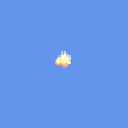
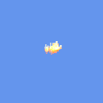

# Particle Types

## Keybrand
Values: `Keybrand` or `0`

## Flame Waders
Values: `FlameWaders` or `1`

## Stellar Tune
Values: `StellarTune` or `2`

## Goat Mount
Values: `WallOfFleshGoatMountFlames` or `3`

## Dark Harvest Hit
Values: `BlackLightningHit` or `4`

## Rainbow Rod Hit
Values: `RainbowRodHit` or `5`

## Dark Harvest Buff
Values: `BlackLightningSmall` or `6`

## Stardust Guardian Punches
Values: `StardustPunch` or `7`

## Resonance Scepter
Values: `PrincessWeapon` or `8`

